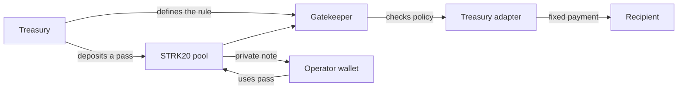

# BlackBox Protocol

BlackBox lets a Starknet treasury give an operator a limited onchain permission
without giving them the treasury key or adding their wallet to a public role
list.

The permission is represented by a STRK20 bearer pass. The rule itself stays
public and is enforced by Cairo: fixed target, fixed selector, payment limit,
expiry, reuse mode, and revocation status.

[Open BlackBox](https://blackbox-arena.vercel.app) ·
[Launch Studio](https://blackbox-arena.vercel.app/studio/) ·
[Read the web docs](https://blackbox-arena.vercel.app/docs)

## What it does

A treasury can use BlackBox Studio to:

1. Choose a payment recipient and STRK budget.
2. Deploy a Gatekeeper, capability token, and treasury adapter.
3. Send a private capability pass to an operator.
4. Share a link that identifies the public policy.
5. Let the operator request only the payment allowed by that policy.

The operator cannot change the recipient, asset, per-payment cap, total budget,
or expiry. The treasury never shares its signing key.



The payment recipient and the operator are separate roles. They can use the
same wallet for a simple setup, but the protocol does not require that.

## Privacy boundary

BlackBox protects the relationship between a capability pass and the wallet
holding it. It does not make the whole transaction private.

| Public | Kept inside the privacy wallet |
|---|---|
| Policy, contracts, asset, recipient, limits, expiry, and mode | Capability note ownership |
| Deposit address, token, and amount | Note plaintext and proof material |
| Final action, calldata, timing, and state change | Link between pass delivery and later use, subject to relay and metadata assumptions |

Transaction-sender separation depends on the wallet relay path. Direct proof
submission can reveal the operator as the sender.

## Contracts

- `CapabilityToken`: an ERC-20-compatible bearer pass tied to one Gatekeeper and
  one STRK20 pool. It records fresh pool delivery for the current transaction.
- `CapabilityGatekeeper`: accepts calls only from the configured pool, consumes
  a fresh pass marker, checks the policy, and forwards the approved action.
- `TreasurySpendAdapter`: fixes the treasury, STRK asset, and payment recipient.
  The operator controls only the requested amount within the public limit.

One-shot policies burn the pass after use. Reusable policies return a fresh
private note, but remain bounded by the treasury allowance and expiry.

## Mainnet deployment

| Component | Address |
|---|---|
| CapabilityGatekeeper | [`0x01126…b8ff8`](https://voyager.online/contract/0x01126ea67555e0d82c51efe0352f9cf99aec81b7af40ff9c3dab4ccced5b8ff8) |
| TreasurySpendAdapter | [`0x021a…0afd7`](https://voyager.online/contract/0x021a77531446c9a0e581e4199d9296d00fe45d279c631d0d0ab16cc66340afd7) |
| CapabilityToken | [`0x0567…9b11d`](https://voyager.online/contract/0x0567bbe5adafeb5920849c695f158bb3d287c702396fa1f87eb9e4978e39b11d) |

The reference policy allows `0.01 STRK` per payment with a `0.03 STRK` treasury
allowance.

- [Policy setup](https://voyager.online/tx/0x07e306f69b729c38597cfe7d2b67e1cac035485220335b976199c2b76c501d1c)
- [Private-pass delivery](https://voyager.online/tx/0x26a63750cb24beb38cc4eb8a976d04458c9015331b63be89a71c309a2b8e589)
- [Successful `0.01 STRK` exercise](https://voyager.online/tx/0x7978bc0e9292a86c9e01411784dd6ec3db117e967a2ec08a2131844579d1386)


## Run locally

Requirements:

- Node.js 22 or newer
- Scarb 2.17.0
- Starknet Foundry 0.59.0

```sh
npm install
npm run verify
npm run dev
```

Open `http://localhost:4173`. Studio is available at
`http://localhost:4173/studio/`.

Contract tests:

```sh
cd contracts
scarb build
snforge test
```

The STRK20 integration test needs a prepared checkout of
[`starknet-privacy`](https://github.com/starkware-libs/starknet-privacy):

```sh
BLACKBOX_PRIVACY_REPO=/absolute/path/to/starknet-privacy npm run verify:capability
```

## Use the SDK

```js
import { buildWalletApiCapabilityActions } from "@blackbox/capability-sdk";

const actions = buildWalletApiCapabilityActions({
  policy,
  holderAddress: wallet.address,
  targetCalldata: [amount],
});

await wallet.strk20PrepareInvoke(actions, true);
const result = await wallet.strk20InvokeTransaction(actions);
```

The wallet owns note discovery, proving, and relay submission. The SDK builds
and validates the action plan; Cairo remains the authorization boundary.

See [SDK documentation](packages/capability-sdk/README.md),
[architecture](docs/ARCHITECTURE.md), [privacy model](docs/PRIVACY_MODEL.md),
and [deployment guide](docs/DEPLOYMENT.md).

## Repository structure

```text
apps/studio/                 Self-service treasury mandate application
apps/web/                    Public site, issuer page, and holder page
contracts/                   Cairo capability contracts and tests
packages/capability-sdk/     Policy and Wallet API action builders
packages/devnet-session/     STRK20 integration test harness
configs/                     Public deployment configuration
docs/                        Architecture, privacy, deployment, and testing
```

## Wallet notes

Use a wallet that shows the class hash, compiled class hash, and fee before a
declaration is confirmed. Braavos completed the three class declarations for
the reference deployment. Ready X completed the normal deployment, setup,
private delivery, and capability-use transactions.

The STRK20 pool charges its own public fee in addition to the treasury payment.
Read the current pool fee onchain instead of hard-coding the amount observed in
the reference flow.

## License

[MIT](LICENSE)
