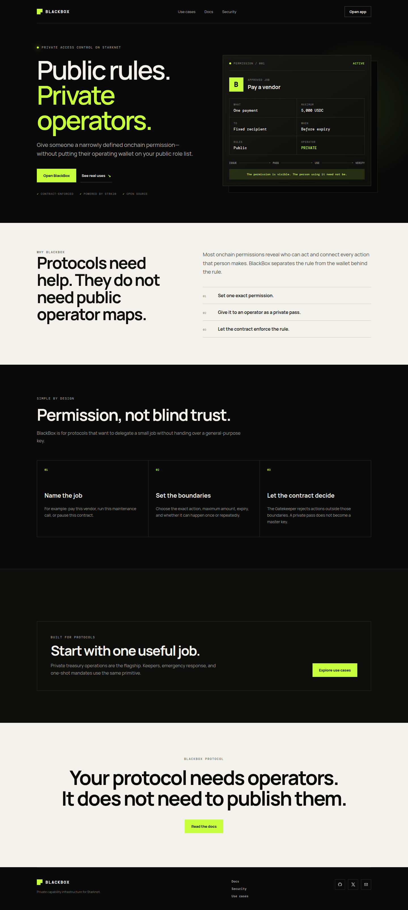
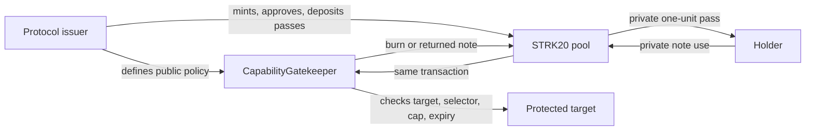
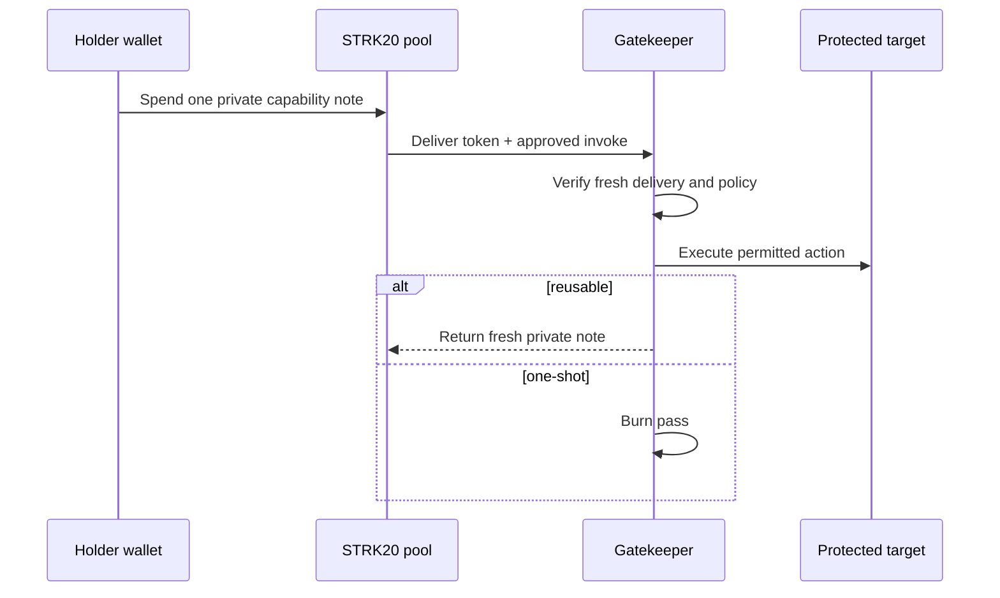
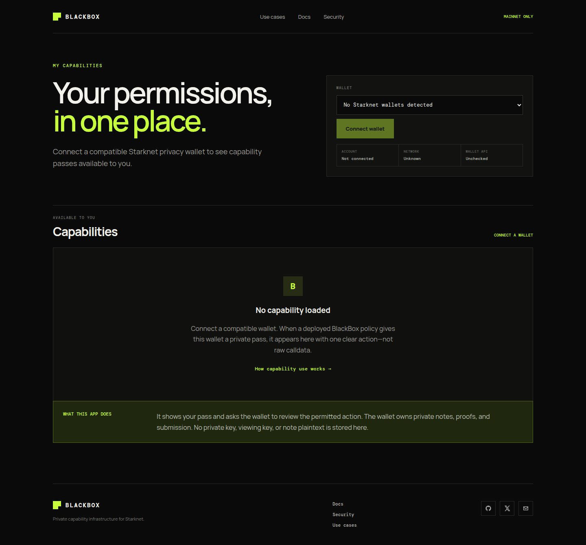
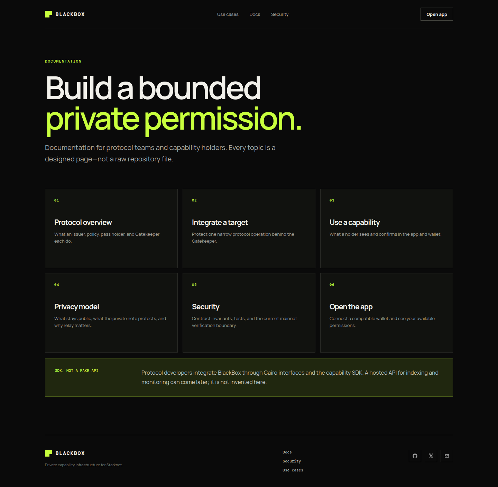
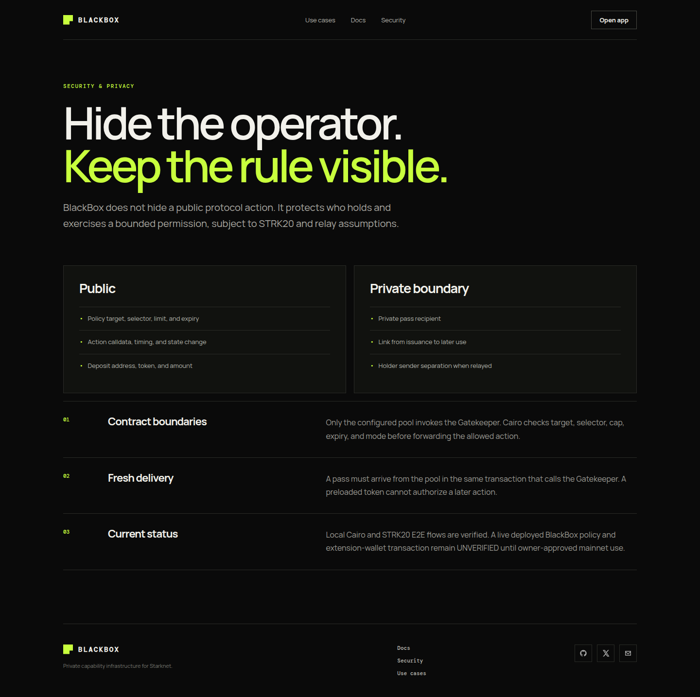
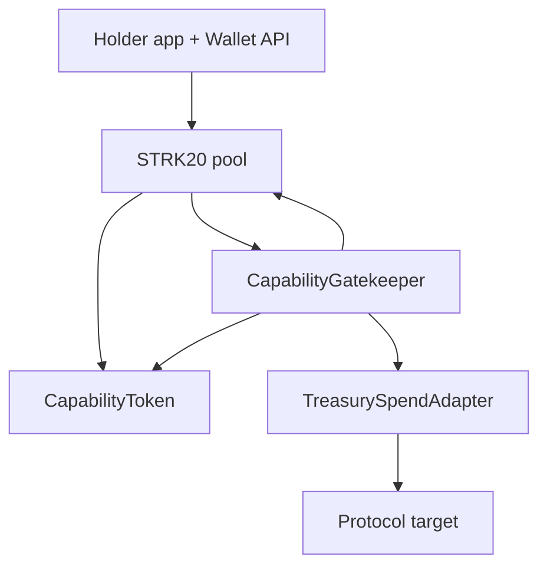
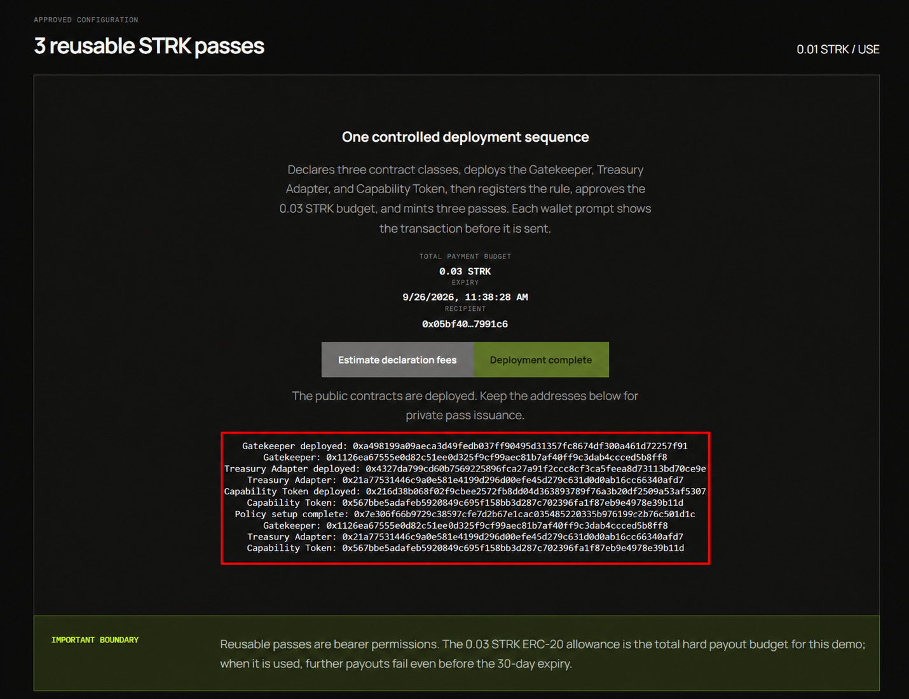

# BlackBox Protocol

> **Public rules. Private operators.**

BlackBox is private capability infrastructure for Starknet. A protocol gives an
operator one bounded job without publishing that operator wallet on a public
role list. Cairo enforces the public rule; STRK20 carries the bearer pass as a
private note.

**Verified locally:** Cairo enforcement and STRK20 RC.2/RC.5 Devnet flow.
**Verified on Mainnet:** all three BlackBox classes, contract instances, and the
first active 0.01 STRK reusable-policy configuration.
**UNVERIFIED:** private STRK20 pass issuance/distribution and real holder
capability exercise on Mainnet.



## The problem

Public role wallets reveal who is authorized and link every action to that
wallet. BlackBox separates authority from the operator wallet: a protocol
publishes the exact allowed action, Cairo checks it, and a private pass is used
to exercise it.

BlackBox does **not** hide the action, target, amount, timing, or deposit edge.
It is not a private multisig, identity system, or arbitrary-call wallet.

## Flow





## Product screens

| Landing | Holder app |
|---|---|
|  |  |

| Documentation | Security |
|---|---|
|  |  |

The holder app shows an honest empty state until a real policy is deployed and
a private pass is issued to the connected wallet. It never invents a balance or
fake transaction.

## Public vs private

| Item | Treatment |
|---|---|
| Policy target, selector, cap, expiry, mode | Public |
| Action calldata, timing, and state change | Public |
| Shield deposit address, token, amount | Public |
| Wallet receiving private pass | Intended hidden by STRK20 notes |
| Issue-to-use link | Intended hidden; metadata assumptions apply |
| Holder in Gatekeeper call | Absent; pool is caller |
| Transaction sender | Requires relay/outside execution for separation |

Never call shielding private. Browser, wallet, RPC, timing, and network
metadata are outside the contract guarantee.

## Architecture



### Core contracts

- `CapabilityToken`: one base unit is one pass; records pool-to-Gatekeeper
  delivery for the current transaction.
- `CapabilityGatekeeper`: pool-only entrypoint; checks policy, consumes a fresh
  pass, forwards the approved call, then burns or returns the pass.
- `TreasurySpendAdapter`: reference target with fixed treasury, asset, and
  recipient. The holder controls only a capped amount.

## Use cases

1. Private treasury operator: capped payment to a fixed vendor.
2. Private keeper: repeatable maintenance call before expiry.
3. Emergency guardian: short-lived, narrow pause authority.
4. One-shot mandate: one migration, claim, liquidation, or settlement action.

## Build on it

### Prerequisites

- Node.js 22+
- Scarb 2.17.0 and Starknet Foundry 0.59.0
- Prepared Starknet Privacy checkout for Devnet E2E

```sh
npm install
npm run verify
npm run dev
# http://localhost:4173
```

### Verify the real privacy path

```sh
npm run verify:capability

# Prepared official RC.5 checkout
BLACKBOX_PRIVACY_REPO=/absolute/path/to/starknet-privacy npm run verify:capability
```

The focused E2E deploys a real local STRK20 pool plus BlackBox contracts,
deposits a pass, exercises reusable and one-shot flows, rediscovers a returned
note, and checks a relay sender distinct from the holder.

### Integrate a protected operation

1. Put the sensitive operation behind a Gatekeeper-only entrypoint or adapter.
2. Keep token, treasury, recipient, and semantic limits fixed where possible.
3. Deploy a token bound to Gatekeeper and privacy pool.
4. Register target, selector, cap, expiry, and mode as public policy.
5. Mint passes to issuer, publicly approve/deposit into STRK20, then privately
   transfer one-unit notes to holders.
6. Use `@blackbox/capability-sdk`; wallet owns notes, proving, and relay.

See [`packages/capability-sdk/README.md`](packages/capability-sdk/README.md)
and [`docs/VNEXT_PROTOCOL.md`](docs/VNEXT_PROTOCOL.md) for interfaces.

## Security evidence

| Attempt | Result |
|---|---|
| Call outside configured pool | Rejected |
| Reuse delivery marker | Rejected |
| Preload pass in earlier transaction | Rejected |
| Wrong pass amount | Rejected |
| Wrong target, selector, or cap breach | Rejected |
| Expired/revoked policy | Rejected |
| Direct treasury adapter call | Rejected |

`npm run verify` passes. Cairo has **111/111** passing tests, including 19
capability/adapter tests. See [`docs/TESTING.md`](docs/TESTING.md) and
[`docs/PRIVACY_MODEL.md`](docs/PRIVACY_MODEL.md) for full evidence.

## Mainnet readiness

```sh
npm run verify:mainnet-readiness
```

This read-only command verifies `SN_MAIN` and the expected STRK20 pool class
hash. It does not sign, deploy, issue a pass, or prove wallet/relayer availability.

Prepare an unsigned public-config-only plan:

```sh
npm run release:capability -- \
  --config configs/capability-deployment.example.json \
  --out dist/capability-release.json
```

No private key, viewing key, mnemonic, signer, or credential belongs in this
repository, config, or browser app. Mainnet remains owner-gated.

## Verified Mainnet deployment

The first BlackBox configuration is live on Starknet Mainnet. The red outline
below marks the transaction and address evidence produced by the deployment
console; it is not a simulated result.



| Component | Mainnet address |
|---|---|
| CapabilityGatekeeper | [`0x01126…b8ff8`](https://voyager.online/contract/0x01126ea67555e0d82c51efe0352f9cf99aec81b7af40ff9c3dab4ccced5b8ff8) |
| TreasurySpendAdapter | [`0x021a…0afd7`](https://voyager.online/contract/0x021a77531446c9a0e581e4199d9296d00fe45d279c631d0d0ab16cc66340afd7) |
| CapabilityToken | [`0x0567…9b11d`](https://voyager.online/contract/0x0567bbe5adafeb5920849c695f158bb3d287c702396fa1f87eb9e4978e39b11d) |

The setup transaction [`0x07e306…501d1c`](https://voyager.online/tx/0x07e306f69b729c38597cfe7d2b67e1cac035485220335b976199c2b76c501d1c)
registered an active reusable policy for `TreasurySpendAdapter.spend`, minted
three issuer-held passes, set a `0.01 STRK` maximum per use, and set a public
`0.03 STRK` total treasury allowance. Read-only state checks confirmed the
configured pool, issuer, adapter, fixed recipient, zero prior spending, and
zero policy uses.

The issuer's private-pass delivery transaction
[`0x26a637…8e589`](https://voyager.online/tx/0x26a63750cb24beb38cc4eb8a976d04458c9015331b63be89a71c309a2b8e589)
succeeded and was accepted on Mainnet at block `13992891`. Its receipt includes
the configured STRK20 pool and CapabilityToken. It is the first and only
successful pool-touching BlackBox transaction recorded in `strk20.json`.
Account B then exercised the pass successfully in transaction
[`0x7978bc…d1386`](https://voyager.online/tx/0x7978bc0e9292a86c9e01411784dd6ec3db117e967a2ec08a2131844579d1386):
the receipt is accepted at block `13993785`, records the Gatekeeper and pool,
and the adapter paid exactly `0.01 STRK` to its fixed recipient. Both successful
pool-touching hashes are recorded in `strk20.json`.

### Wallet note for contract authors

Use the wallet that gives a complete, reviewable declaration confirmation. In
this deployment, Ready X successfully handled normal Mainnet deployment/setup
invokes, but its desktop declaration review never showed a fee or enabled
Confirm—even for a tiny independent Cairo/Sierra test contract in the official
Ready declaration demo. A separate, owner-controlled **Braavos** account was
therefore used only to declare the global classes; the configured Ready X
issuer then deployed and configured the BlackBox instances.

This is an operational fallback, not a BlackBox protocol requirement. Keep the
declaration account separate, fund it only for declarations, never import or
share another wallet's recovery phrase, review every class hash and fee, and
return to the configured issuer wallet for protocol setup and holder flows.

### Current STRK20 wallet-compatibility boundary

The Mainnet contract deployment above is verified; a successful private-pass
issuance is **not** claimed yet. During the live issuer test, Ready X produced
a real STRK20 proof and showed its confirmation UI, but then returned
`INVALID_REQUEST_PAYLOAD` for the proof-backed ordinary invoke. Inspection of
Ready's public extension source shows its normal
`wallet_addInvokeTransaction` handler validates `calls` but does not forward
the optional SNIP-36 proof to its transaction executor. The pool therefore
cannot accept that submission path.

For integrations that use `wallet_strk20PrepareInvoke`, choose a wallet that
explicitly forwards the returned proof through `wallet_addInvokeTransaction`,
or use the wallet's documented native STRK20 submission route. Do not treat a
fixed wait period as a solution: the issuer and recipient deposits had already
aged well beyond the protocol's fresh-state window. Ready's native
`wallet_strk20InvokeTransaction` route is also currently `UNVERIFIED` here: it
returned a Ready Paymaster execution error without a transaction hash. This is
recorded so contributors do not copy an unverified workaround.

Each pool action also needs a separate public STRK allowance for the pool's
live fee, in addition to approval of the action token. On 2026-08-28 the pool
reported a 6 STRK fee and Account A's fee allowance was zero; the issuer page
now reads that fee on-chain and asks the owner to approve it with the one-pass
allowance. This is an allowance, not a fee payment, and issuance remains
`UNVERIFIED` until a Mainnet transaction hash is returned.

## Repository map

```text
contracts/                 Cairo policy, token, and reference adapter
packages/capability-sdk/   Wallet-neutral policy and Wallet API builders
packages/devnet-session/   STRK20 Devnet capability E2E
apps/web/                  Landing, docs, security, and holder app
docs/                      Protocol, network, testing, and handoff evidence
configs/                   Public-only deployment configuration example
```

## Contributing and license

Read [`CONTRIBUTING.md`](CONTRIBUTING.md). Keep authorization contract-owned,
never expose secrets, and mark untested privacy/network claims `UNVERIFIED`.

[MIT License](LICENSE)
