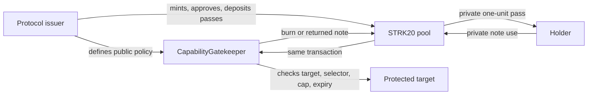
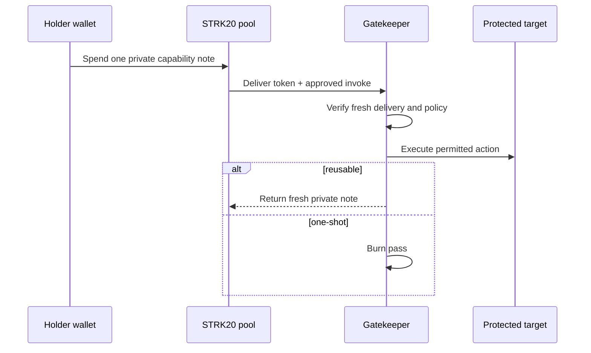
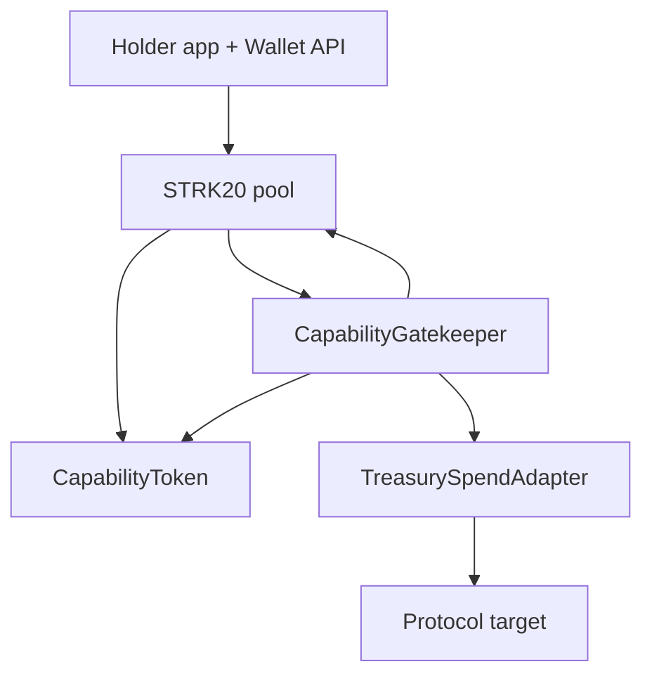

# BlackBox Protocol

> **Public rules. Private operators.**

BlackBox is private capability infrastructure for Starknet. A protocol gives an
operator one bounded job without publishing that operator wallet on a public
role list. Cairo enforces the public rule; STRK20 carries the bearer pass as a
private note.

**Verified locally:** Cairo enforcement and STRK20 RC.2/RC.5 Devnet flow.
**UNVERIFIED:** mainnet deployment and real extension-wallet execution.


## The problem

Public role wallets reveal who is authorized and link every action to that
wallet. BlackBox separates authority from the operator wallet: a protocol
publishes the exact allowed action, Cairo checks it, and a private pass is used
to exercise it.

BlackBox does **not** hide the action, target, amount, timing, or deposit edge.
It is not a private multisig, identity system, or arbitrary-call wallet.

## Flow





## Product screens

| Landing | Holder app |
|---|---|
|  |  |

| Documentation | Security |
|---|---|
|  |  |

The holder app shows an honest empty state until a real policy is deployed and
a private pass is issued to the connected wallet. It never invents a balance or
fake transaction.

## Public vs private

| Item | Treatment |
|---|---|
| Policy target, selector, cap, expiry, mode | Public |
| Action calldata, timing, and state change | Public |
| Shield deposit address, token, amount | Public |
| Wallet receiving private pass | Intended hidden by STRK20 notes |
| Issue-to-use link | Intended hidden; metadata assumptions apply |
| Holder in Gatekeeper call | Absent; pool is caller |
| Transaction sender | Requires relay/outside execution for separation |

Never call shielding private. Browser, wallet, RPC, timing, and network
metadata are outside the contract guarantee.

## Architecture



### Core contracts

- `CapabilityToken`: one base unit is one pass; records pool-to-Gatekeeper
  delivery for the current transaction.
- `CapabilityGatekeeper`: pool-only entrypoint; checks policy, consumes a fresh
  pass, forwards the approved call, then burns or returns the pass.
- `TreasurySpendAdapter`: reference target with fixed treasury, asset, and
  recipient. The holder controls only a capped amount.

## Use cases

1. Private treasury operator: capped payment to a fixed vendor.
2. Private keeper: repeatable maintenance call before expiry.
3. Emergency guardian: short-lived, narrow pause authority.
4. One-shot mandate: one migration, claim, liquidation, or settlement action.

## Build on it

### Prerequisites

- Node.js 22+
- Scarb 2.17.0 and Starknet Foundry 0.59.0
- Prepared Starknet Privacy checkout for Devnet E2E

```sh
npm install
npm run verify
npm run dev
# http://localhost:4173
```

### Verify the real privacy path

```sh
npm run verify:capability

# Prepared official RC.5 checkout
BLACKBOX_PRIVACY_REPO=/absolute/path/to/starknet-privacy npm run verify:capability
```

The focused E2E deploys a real local STRK20 pool plus BlackBox contracts,
deposits a pass, exercises reusable and one-shot flows, rediscovers a returned
note, and checks a relay sender distinct from the holder.

### Integrate a protected operation

1. Put the sensitive operation behind a Gatekeeper-only entrypoint or adapter.
2. Keep token, treasury, recipient, and semantic limits fixed where possible.
3. Deploy a token bound to Gatekeeper and privacy pool.
4. Register target, selector, cap, expiry, and mode as public policy.
5. Mint passes to issuer, publicly approve/deposit into STRK20, then privately
   transfer one-unit notes to holders.
6. Use `@blackbox/capability-sdk`; wallet owns notes, proving, and relay.

See [`packages/capability-sdk/README.md`](packages/capability-sdk/README.md)
and [`docs/VNEXT_PROTOCOL.md`](docs/VNEXT_PROTOCOL.md) for interfaces.

## Security evidence

| Attempt | Result |
|---|---|
| Call outside configured pool | Rejected |
| Reuse delivery marker | Rejected |
| Preload pass in earlier transaction | Rejected |
| Wrong pass amount | Rejected |
| Wrong target, selector, or cap breach | Rejected |
| Expired/revoked policy | Rejected |
| Direct treasury adapter call | Rejected |

`npm run verify` passes. Cairo has **111/111** passing tests, including 19
capability/adapter tests. See [`docs/TESTING.md`](docs/TESTING.md) and
[`docs/PRIVACY_MODEL.md`](docs/PRIVACY_MODEL.md) for full evidence.

## Mainnet readiness

```sh
npm run verify:mainnet-readiness
```

This read-only command verifies `SN_MAIN` and the expected STRK20 pool class
hash. It does not sign, deploy, issue a pass, or prove wallet/relayer availability.

Prepare an unsigned public-config-only plan:

```sh
npm run release:capability -- \
  --config configs/capability-deployment.example.json \
  --out dist/capability-release.json
```

No private key, viewing key, mnemonic, signer, or credential belongs in this
repository, config, or browser app. Mainnet remains owner-gated.

## Repository map

```text
contracts/                 Cairo policy, token, and reference adapter
packages/capability-sdk/   Wallet-neutral policy and Wallet API builders
packages/devnet-session/   STRK20 Devnet capability E2E
apps/web/                  Landing, docs, security, and holder app
docs/                      Protocol, network, testing, and handoff evidence
configs/                   Public-only deployment configuration example
```

## Contributing and license

Read [`CONTRIBUTING.md`](CONTRIBUTING.md). Keep authorization contract-owned,
never expose secrets, and mark untested privacy/network claims `UNVERIFIED`.

[MIT License](LICENSE)
